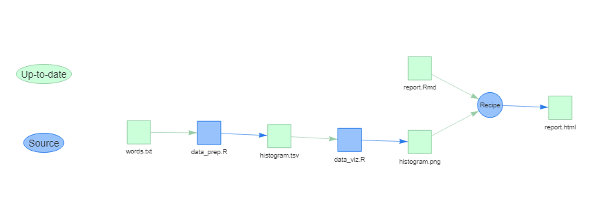

# Pipeline automation

This repository contains a minimal example of a data processing pipeline which
has been automated in two ways, first using `GNU Make` and second using 
[`makepipe`](https://github.com/kinto-b/makepipe). In the former case, the 
heavy lifting is being done by the [`Makefile`](Makefile); in the latter
case, by [`pipeline.R`](pipeline.R). 

The pipeline, which I have lifted directly from Jenny Bryan's [STAT545 course](https://stat545.com/automating-pipeline.html) does four things. It:
    
  1. Obtains a large file of English words.
  2. Calculates a histogram of word lengths.
  3. Generates a figure of this histogram.
  4. Renders a R Markdown report in HTML.

A dependency graph for this pipeline is produced by the `makepipe` pipeline:

## Presentation
The `presentation/` subdirectory contains slides for a brief presentation on
pipeline automation tools delivered at the Social Research Centre in November
2021.
