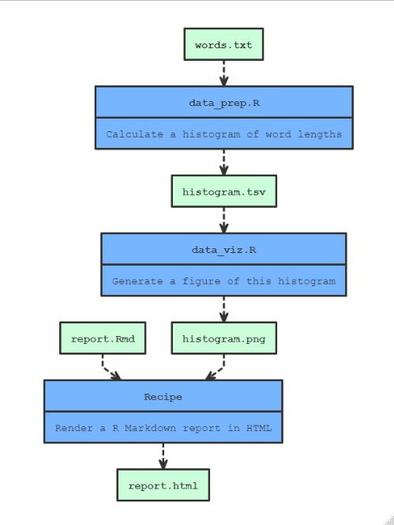

```{r setup, include=FALSE}
options(htmltools.dir.version = FALSE)
```

<style type="text/css">
.remark-code { 
  font-family: 'Source Code Pro', 'Lucida Console', Monaco, monospace;
  font-size: 16px;
}
</style>

class: inverse, center, middle

# The Problem 

---

.pull-left[

]

.pull-right[
The directory structure:

```
report_tables
+- data/
+- output/
+- 1_data_prep.R
+- 2_tables_output.R
  +- 2.1_tech_tables.R
  \- 2.2_extra_tables.R
\- 3_report.Rmd
```
<br/>
Very confusing!
]

???
Have you ever found yourself with a pipeline that looks like this? 

I have. In fact, this is basically what the SES report table production pipeline looks like. (Actually, believe it or not, the SES pipeline is quite a bit worse than this). 

It's very confusing!

If you run all of the scripts through in the order that they're numbered, then -- in theory -- you're right as rain. 

But you might not want to do that. You might want to run the pipeline selectively, perhaps because parts of it take a really long time.

But if you do that, then you've got to be very careful. For example, ...


---

class: inverse, center, middle

# The Solution

---
# `make`

```make
all: output/report.html

clean:
		rm -f output/* data/1* data/2*

data/1_data.Rds: 1_data_prep.R data/0_raw.Rds
		Rscript $<

data/2.1_tech_tables.xlsx: 2.1_tech_tables.R data/0_tech_tables.xlsx
		Rscript $<

data/2.2_extra_tables: 2.2_extra_tables.R data/1_data.Rds
		Rscript $<

data/2_report_tables.xlsx: 2_tables_output.R data/2.2_extra_tables.xlsx data/2.1_tech_tables.xlsx data/1_data.Rds
		Rscript $<

output/report.html: 3_report.rmd data/2_report_tables.xlsx
		Rscript -e 'rmarkdown::render("$<")'
```

???
There's a solution to this problem. 

Here it is. 

This is a makefile. It's essentially a set of rules specifying how the pipeline is to be run through. 

When this script is run, make will automatically figure out **which** pieces of your pipeline need to be run and **when** they need to be run, and then it will go ahead and run them.

By the end of this presentation, you should be able to get started on automating your own pipelines using make. 


---

class: inverse, center, middle

# Getting Started
## `make`

???
So: getting started. 

I'll run through the next few slides fairly quickly. They're mostly here as a reference in case you want to set up make on your own machine later. 

There are a couple of slides on installation.

And then there's a couple of slides on taking make for a spin, which I encourage you to step through at some point. 

I'll actually just do a quick demo. It won't take long. [...]

---
# Installation

`GNU Make v4.2.1` is installed along with `Rtools`, which can be downloaded
here: http://cran.rstudio.com/bin/windows/Rtools/.

If `Rtools` is installed and (for Windows users) on the `PATH`, you should get
see this when executing `make --version` at the prompt:

```
GNU Make 4.2.1
Built for i686-pc-msys
Copyright (C) 1988-2016 Free Software Foundation, Inc.
License GPLv3+: GNU GPL version 3 or later <http://gnu.org/licenses/gpl.html>
This is free software: you are free to change and redistribute it.
There is NO WARRANTY, to the extent permitted by law.
```

---
# Installation

If you do not receive this message, then `make` is not accessible. 

You will need to install `Rtools` if it isn't installed already, and add the
folder containing `make` to the PATH. On my machine that's

```
C:\rtools40\usr\bin
```

---
# Test drive

Initialise a new RStudio project and create a text file containing the
following:

```yaml
all:
		@echo Build all

clean:
		@echo Clean all
```

Save it out as `Makefile` (no extension), then restart RStudio and hit `Build all`
on the Build pane.

---
# Troubleshooting

If you see something like the following, it's probably because RStudio
is inserting spaces for tabs.

```
Makefile:2: *** missing separator.  Stop.
```

To change this go to `RStudio > Tools > Project Options... > Code Editing` and
deselect `Insert spaces for tab`

---
# Test drive (cont.)

Now when you hit `Build all`, you should see something like this:

```
Build all
```

The same thing (and lots more) can be achieved using the shell. Open up it up,
`Tools > Shell...`, and type `make clean`. This is what
you should see:

```
$ make clean
Clean all
```

???
That's because the `Build all` button runs the `all:` directive in the
`Makefile`, which includes the command to echo "Build all". Other options on
the Build pane include `Clean all` and `Clean and Rebuild`. Try them out too!

---
# Flashback

```make
all: output/report.html

clean:
		rm -f output/* data/1* data/2*

data/1_data.Rds: 1_data_prep.R data/0_raw.Rds
		Rscript $<

data/2.1_tech_tables.xlsx: 2.1_tech_tables.R data/0_tech_tables.xlsx
		Rscript $<

data/2.2_extra_tables: 2.2_extra_tables.R data/1_data.Rds
		Rscript $<

data/2_report_tables.xlsx: 2_tables_output.R data/2.2_extra_tables.xlsx data/2.1_tech_tables.xlsx data/1_data.Rds
		Rscript $<

output/report.html: 3_report.rmd data/2_report_tables.xlsx
		Rscript -e 'rmarkdown::render("$<")'
```

???
Now return to the Makefile I showed you a moment ago. You can see the "all" and the "clean" targets there. And those can be run from the Build tray just like in the previous example. 

Here, however, the "all" target isn't associated with a recipe. It's only associated with what's called a prerequisite. What does that mean?

Let's talk about the structure of a Makefile.

---
# Structure

A `make` file is a just a collection of **rules**, each of which has this
general structure:

```make
target: prereq_1 prereq_2 ...
		recipe
		...
```

- The **targets** are the things we want to make.
- A target's **prerequisites** are the things we need in order to make the target
- The **recipe** attached to a target tell us how to make it. It is made up
of one or more **commands**, each of which sits on its own line.

Assuming the `make` file is well-formed, `make` will figure out on its own
which scripts need to be run and when. All you need to do is hit `Build all`!

???

Each chunk in a Makefile is called a rule. They've got this basic structure: target on the left, prerequisite on the right, and recipe indented below. 

When you hit Build in RStudio, make tries to make the "all" target, which is known as a phony target, since it's not actually associated with a file. 

In the first example, that meant just following the recipe, which involved printing "Build all". 

But in the second example, that meant first making the prerequisite of the "all" target. 

etc. etc. eventually make ends up here [first rule] and finds that neither of the pre-reqs have rules associated with them. So this target can be made by following the recipe, which is just one line. But before make actually follows the recipe, it will check whether there have been any changes to the pre-reqs since it last ran. If there haven't been, then make doesn't bother following the recipe.

---
class: inverse, center, middle

# Building a pipeline<sup>1</sup>


.footnote[
[1] This example is lifted straight out of Jenny Bryan's course: https://stat545.com/automating-pipeline.html
]

---
# Outline

Here's what we want to do:
* Acquire some raw data
* Prepare it
* Visualise it
* Report it

---
# Acquisition

This step is simple. We just want to download the wordset that comes with *nix
systems.

We create a `Makefile` and add this:

```yaml
data/words.txt:
		Rscript -e 'download.file("https://svnweb.freebsd.org/base/head/share/dict/web2?view=co", destfile = "data/words.txt", quiet = TRUE)'
```

---
# Acquisition

We can execute the `Makefile` from the shell by writing

```
make words.txt
```

To execute it from the Build pane, we need to add the phony `all` and `clean`
targets to the `Makefile`

```yaml
*all: data/words.txt

*clean:
*		rm -f data/words.txt

data/words.txt:
		Rscript -e 'download.file("https://svnweb.freebsd.org/base/head/share/dict/web2?view=co", destfile = "data/words.txt", quiet = TRUE)'
```

---
# Preparation

This step is a bit more complicated. So we'll do it in an R script called
`data_prep.R`.

Here's what it looks like

```r
words <- readLines("data/words.txt")
Length <- nchar(words)
hist_dat <- table(Length)
write.table(hist_dat, "data/histogram.tsv",
						sep = "\t", row.names = FALSE, quote = FALSE)
```

---
# Preparation

And here's what our `Makefile` looks like:

```yaml
*all: data/histogram.tsv      

clean:
		rm -f data/words.txt

data/words.txt:
		Rscript -e 'download.file("https://svnweb.freebsd.org/base/head/share/dict/web2?view=co", destfile = "data/words.txt", quiet = TRUE)'

data/histogram.tsv: data_prep.R data/words.txt
*		Rscript $<         
```

---
# Visualisation

We'll also do this in an R script, called `data_viz.R`:

```r
library(ggplot2)
qplot(Length, Freq, data = read.delim("data/histogram.tsv"))
ggsave("data/histogram.png")
```

Our `Makefile` is now:

```yaml
*all: data/histogram.png

clean:
		rm -f data/*

data/words.txt:
		Rscript -e 'download.file("https://svnweb.freebsd.org/base/head/share/dict/web2?view=co", destfile = "data/words.txt", quiet = TRUE)'

data/histogram.tsv: data_prep.R data/words.txt
		Rscript $<

data/histogram.png: data_viz.R data/histogram.tsv
		Rscript $<
```

---
# Reporting

Finally, we set up an RMarkdown file, which I won't show, called
`report.Rmd`. And we update our `Makefile` once more:

```yaml
all: output/report.html

clean:
		rm -f data/*

data/words.txt:
		Rscript -e 'download.file("https://svnweb.freebsd.org/base/head/share/dict/web2?view=co", destfile = "data/words.txt", quiet = TRUE)'

data/histogram.tsv: data_prep.R data/words.txt
		Rscript $<

data/histogram.png: data_viz.R data/histogram.tsv
		Rscript $<

output/report.html: report.Rmd data/histogram.png
*		Rscript -e 'rmarkdown::render("$<", output_file = "$@")'
```

---
# Running

Now when we hit `Clean and Rebuild` our entire pipeline is executed in the
correct order, and our report is generated.


Pretty handy!

---
# Re-running

But there's more: `make` only updates targets whose dependencies have changed!

- Re-running without changes:

```
make: Nothing to be done for 'all'.
```

- Re-running with changes to `data_viz.R`

```
Rscript data_viz.R
Saving 7 x 7 in image
Rscript -e 'rmarkdown::render("report.Rmd")'
```

???
Now that we have run the pipeline through once, try running it again. If no
changes have been made, only the last step will be executed. You'll only see
this in the Build pane.


If you make a change to `data_viz.R` and re-run, you'll see that `make` runs
that step too:

---
# Clean-up

A final convenience. We can easily take care of unwanted by-products of data
processing annoyances using additional `make` commands:

```yaml
all: output/report.html

clean:
		rm -f data/*

data/words.txt:
		Rscript -e 'download.file("https://svnweb.freebsd.org/base/head/share/dict/web2?view=co", destfile = "data/words.txt", quiet = TRUE)'

data/histogram.tsv: data_prep.R data/words.txt
		Rscript $<

data/histogram.png: data_viz.R data/histogram.tsv
		Rscript $<
*		rm Rplots.pdf 

output/report.html: report.Rmd data/histogram.png
		Rscript -e 'rmarkdown::render("$<", output_file = "$@")'
```

???
If you were following along, you might have noticed that whenever we run our `data_viz.R` script, an unwanted `Rplots.pdf` file is generated. This is an annoying byproduct of 
ggplot that we'd like to automatically get rid of after producing the required plot.


---
class: inverse, center, middle

# An R-based alternative
## `targets`

---

# Drawbacks

- Relatively steep learning curve
<br>


- Demands highly functionalised code

---

class: inverse, center, middle

# An R-based alternative
## ~~`targets`~~
## `makepipe`

---

# Getting started

`makepipe` is on CRAN, so all you need to do is:

```r
install.packages('makepipe')
```

---
# Flashback

```make
all: output/report.html

clean:
		rm -f data/*

data/words.txt:
		Rscript -e 'download.file("https://svnweb.freebsd.org/base/head/share/dict/web2?view=co", destfile = "data/words.txt", quiet = TRUE)'

data/histogram.tsv: data_prep.R data/words.txt
		Rscript $<

data/histogram.png: data_viz.R data/histogram.tsv
		Rscript $<
		rm Rplots.pdf 

output/report.html: report.Rmd data/histogram.png
		Rscript -e 'rmarkdown::render("$<", output_file = "$@")'
```

---
# makepipe-ify

```r
if (!file.exists("data/words.txt")) download.file("https://svnweb.freebsd.org/base/head/share/dict/web2?view=co", destfile = "data/words.txt", quiet = TRUE)

makepipe::make_with_source(
	source = "data_prep.R",
	targets = "data/histogram.tsv",
	dependencies = "data/words.txt"
)

makepipe::make_with_source(
	source = "data_viz.R",
	targets = "data/histogram.png",
	dependencies = "data/histogram.tsv"
)

if (file.exists("Rplots.pdf")) file.remove("Rplots.pdf") # Clean up unwanted .pdf by-product

makepipe::make_with_recipe(
	recipe = {
		rmarkdown::render("report.Rmd", output_file = "output/report.html")
	},
	targets = "output/report.html",
	dependencies = c("report.Rmd", "data/histogram.png")
)
```

---
# Execution meta-data

```r
res <- makepipe::make_with_source(
	source = "data_prep.R",
	targets = "data/histogram.tsv",
	dependencies = "data/words.txt"
)

*res # Print execution meta-data 

#> # makepipe segment
#> * Source: 'data_prep.R'
#> * Targets: 'data/histogram.tsv'
#> * File dependencies: 'data/words.txt'
#> * Executed: TRUE
#> * Result: 1 object(s)
#> * Environment: 0x0000021fbcc4be10
```

---
# Object registration

Add to data_prep.R script:

```r
words <- readLines("data/words.txt")
Length <- nchar(words)
hist_dat <- table(Length)
*makepipe::make_register(hist_dat, 'hist_dat')
write.table(hist_dat, "data/histogram.tsv",
						sep = "\t", row.names = FALSE, quote = FALSE)
```

Then in pipeline

```r
res <- makepipe::make_with_source(
	source = "data_prep.R",
	targets = "data/histogram.tsv",
	dependencies = "data/words.txt"
)

# Print to console check on histogram data
*if(res$executed) print(res$result$hist_data)  
```

---
# Automatic documentation

```r
makepipe::show_pipeline()
```



---
# Automatic documentation

And the SES report tables:


---
class: inverse, center, middle

# Thanks!

---
# Links

* `make`
	* Manual: https://www.gnu.org/software/make/manual/make.html
	* A simple tutorial: https://kbroman.org/minimal_make/
	* Another tutorial: https://stat545.com/automation-overview.html
* `makepipe`
  * GitHub: https://github.com/kinto-b/makepipe/
  * Documentation: https://kinto-b.github.io/makepipe/
  * Minimal example: https://github.com/kinto-b/makepipe_example/
* `targets`
  * GitHub: https://github.com/ropensci/targets/
  * Documentation: https://docs.ropensci.org/targets/
  * User Manual: https://books.ropensci.org/targets/

